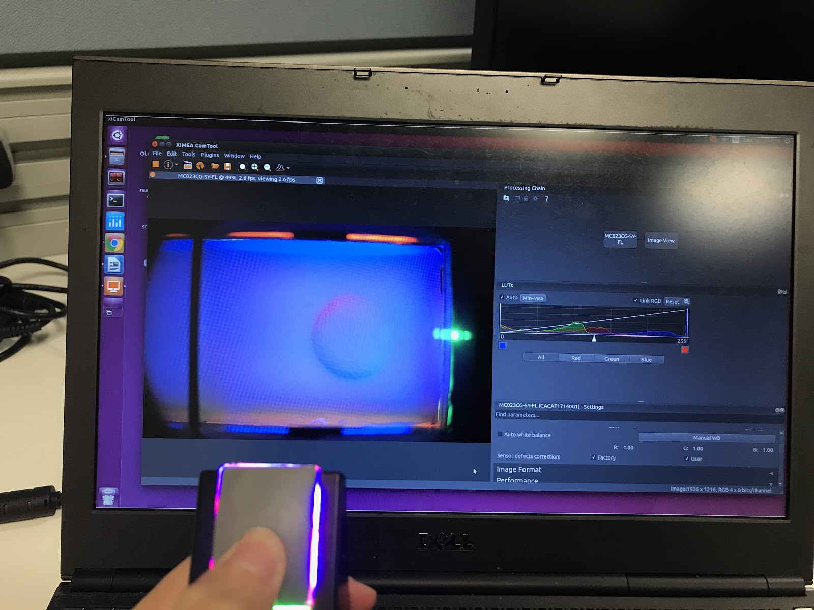

# GelSight Tactile Sensor Demo - Dextrob version
*This project is adapted from GelSightInc [tactiledemo](https://github.com/gelsightinc/tactiledemo) and [sdkdemo](https://github.com/gelsightinc/sdkdemo) with additional implementation of ROS integration, customized projects and documentation files.* <br/>

This project demonstrates how to grab images from the GelSight tactile sensor, push them through the GelSightSDK to convert to 3D and then convert the 3D data
into OpenCV CV_32F format. 

## Prerequisites

This demo assumes you have several third-party packages installed. Here are the packages and basic installation instructions.

 - Ximea API: Download the Ximea XPI from [XIMEA Linux Software](https://www.ximea.com/support/wiki/apis/XIMEA_Linux_Software_Package) and install according to the instructions. It will install the Ximea libraries to /usr/lib and the headers to /usr/include/m3api. <br/>
Note: the current camera info can be found from [here](https://www.ximea.com/en/products/usb-31-gen-1-with-sony-cmos-xic/mc031cg-sy), which use `./install` instead of `./install -pcie` <br/>
check `export LD_LIBRARY_PATH=/opt/XIMEA/lib:$LD_LIBRARY_PATH` in `~/.bashrc`
 - OpenCV: Download and use CMake to build OpenCV. In our case, only OpenCV 3.4, not 4.x, works. [Install OpenCV 3.4 on Ubuntu18](https://learnopencv.com/install-opencv-3-4-4-on-ubuntu-18-04/). After make install, the libraries will be installed to /usr/local/lib. <br/> *The original repo suggests opencv_world: "modify the CMake settings to build opencv_world for convenince."?* 
 - GelSightSdk: Get the latest version of GelSightSdk (C++ code to initiate sensor and retrieve data) for Linux from support@gelsight.com. In our case, the licenses are obtained through emailing the vendor directly and the licenses are system-dependent (Ubuntu 18/20) with expiry dates. <br/>
The software expects to find the license file `gelsight_64.bin` in `$GS_SDK/lib`. Therefore, after obtaining the license file, define the GS_SDK environment variable to specify the location of the GelSightSdk folder on your machine, i.e set the following in `~/.bashrc`
```
export GS_SDK=/home/ruihan/Desktop/GelSight/GelSightSdk20210113_Ubuntu18
export LD_LIBRARY_PATH=$GS_SDK/lib:$LD_LIBRARY_PATH
```

## Testing the camera
Run the xiCamTool software by either 
 - Double clicking the xiCamTool icon that is installed at the desktop by default
 - Running `/opt/XIMEA/bin/xiCamTool` in a new terminal

You can test the camera by running xiCamTool. The basic settings are:
 - Basic -> Auto exposure: unchecked
 - Basic -> Exposure: 2 ms (between 1 and 3 ms depending on the camera/lens)
 - Trigger, Device I/O ->  Device IO Setup... -> GPO1: Exposure active 
 - Performance -> Control FPS: Frame Rate Limit
 - Performance -> Frame rate: 80 FPS

The `Exposure active` settings for GPO (General Purpose Output) triggers the LEDs using the camera strobe. When the exposure is active, the strobe is HIGH, turning the lights on. It is normal for the lights to flicker with the camera. 

You should be able to click the triangle in the upper left corner of xiCamTool and see a live image at 80 FPS with the lights on, similar to the following in xiCamTool <br/>


## Checklist/tips for debugging
* If you encounter the following issue is when running xiCOP in /opt/XIMEA/bin: <br/>
 `[MC050MG-SY-UB/CIMAU1633011] Kernel setting usbcore.usbfs_memory_mb is too low.` <br/>
Execute the following command: <>
`sudo tee /sys/module/usbcore/parameters/usbfs_memory_mb >/dev/null <<<0`
```

## Known issue
* If you run `ruihan@Precision-M4800:~/package/examples/xiSample$ ./xiSample` or any abovementioned command in terminal, the following errors may occur, which is currently ignored as long as xiCamTool returns reasonale images. (The log level can also be set in xiCamTool)
```
...
xiAPI: xiAPI error: Expected XI_OK 
```

## Building the sdkdemo
Download the software: <br/>
 - http://www.gelsight.com/downloads/GelSightSdk20210113.Ubuntu18.tar.gz (for Ubuntu18)
- http://www.gelsight.com/downloads/GelSightSdk20210114.U20.tar.gz (for Ubuntu20)
Download the license: <br/>
 - http://www.gelsight.com/downloads/AStar_gelsight_64.bin (for Ubuntu18) (currently expires on Jan 14, 2022)
 - http://www.gelsight.com/downloads/AStar_Ub20_gelsight_64.bin (for Ubuntu20)
On linux, run the following: (take Ubuntu 18 filenames as an example)
```
sudo mkdir -m 777 /etc/gelsight

cp AStar_gelsight_64.bin /etc/gelsight/gelsight_64.bin

tar -xzf GelSightSdk20210113.Ubuntu18.tar.gz

git clone https://github.com/gelsightinc/sdkdemo.git sdkdemo

cd sdkdemo

export GS_SDK <path to GelSightSdk20210113.Ubuntu18>

mkdir build

cd build

cmake ..; make

./demo/demo
```
A sample successful output of `./demo/demo` should be something like the followings (which takes a few minutes to run):
```
(base) ruihan@ruihan-MS-7B18:~/Desktop/GelSight/sdkdemo/build$ ./demo/demo
device node not found
[ - 01:57:17] operator(): File-based licensing enabled with path "/etc/gelsight/"
[ - 01:57:17] operator(): Activation-based licensing enabled
Licenses found by module:  '/home/ruihan/Desktop/GelSight/GelSightSdk20210113_Ubuntu18/lib/'
     AnalysisPlugin       uncounted version         =2.0 - expires        : Jan-14-2022
        ApplePlugin       uncounted version         =2.0 - expires        : Jan-14-2022
         CaptureApp       uncounted version         =2.0 - expires        : Jan-14-2022
            SdkCore       uncounted version         =2.0 - expires        : Jan-14-2022

[ - 01:57:17] scanForPluginsImpl: Number of plugins added = 1
Running calibration algorithm...
calibration took 30.8643 seconds
Loading saved calibration data: ../testdata/model-dome.yaml
Running photometric stereo algorithm on ../testdata/R513-500/scan.yaml
Loaded 6 images
Integrating surface normals...
Saving heightmap: ../testdata/R513-500/output.tmd
Saving normal map: ../testdata/R513-500/output_nrm.png
(base) ruihan@ruihan-MS-7B18:~/Desktop/GelSight/sdkdemo/build$
```

## Building the tactiledemo
After following the abovementioned steps and installing the dependencies (esp. OpenCV 3.4), git clone [tactiledemo repo](https://github.com/RuihanGao/tactiledemo) and build the package. <br/>
Note: make sure that you have set the directory that contains "OpenCVConfig.cmake" file in `~/.bashrc`. 
```
export OpenCV_DIR=/home/ruihan/opencv_build/installation/OpenCV-3.4.4/share/OpenCV/
```
A sample terminal output looks like the following:

```
(base) ruihan@ruihan-MS-7B18:~/Desktop/GelSight/tactiledemo$ mkdir build
(base) ruihan@ruihan-MS-7B18:~/Desktop/GelSight/tactiledemo$ cd build
(base) ruihan@ruihan-MS-7B18:~/Desktop/GelSight/tactiledemo/build$ cmake ..
-- The CXX compiler identification is GNU 7.5.0
-- Check for working CXX compiler: /usr/bin/c++
-- Check for working CXX compiler: /usr/bin/c++ -- works
-- Detecting CXX compiler ABI info
-- Detecting CXX compiler ABI info - done
-- Detecting CXX compile features
-- Detecting CXX compile features - done
-- The C compiler identification is GNU 7.5.0
-- Check for working C compiler: /usr/bin/cc
-- Check for working C compiler: /usr/bin/cc -- works
-- Detecting C compiler ABI info
-- Detecting C compiler ABI info - done
-- Detecting C compile features
-- Detecting C compile features - done
-- Found GelSightSdk: /home/ruihan/Desktop/GelSight/GelSightSdk20210113_Ubuntu18/lib/libgscore.so  
-- Found OpenCV: /home/ruihan/opencv_build/installation/OpenCV-3.4.4 (found suitable version "3.4.13", minimum required is "3.4") 
-- Found XIMEA: /usr/lib/libm3api.so  
-- Configuring done
-- Generating done
-- Build files have been written to: /home/ruihan/Desktop/GelSight/tactiledemo/build
(base) ruihan@ruihan-MS-7B18:~/Desktop/GelSight/tactiledemo/build$ make
Scanning dependencies of target demo
[ 33%] Building CXX object Demo/CMakeFiles/demo.dir/Demo.cpp.o
/home/ruihan/Desktop/GelSight/tactiledemo/Demo/Demo.cpp: In function ‘int main(int, char**)’:
/home/ruihan/Desktop/GelSight/tactiledemo/Demo/Demo.cpp:28:19: warning: ‘void gsSdkInitialize()’ is deprecated: This function is obsolete and will be removed in a future version.  Use gsSdkInitializeEx instead [-Wdeprecated-declarations]
   gsSdkInitialize();
                   ^
In file included from /home/ruihan/Desktop/GelSight/tactiledemo/Demo/Demo.cpp:4:0:
/home/ruihan/Desktop/GelSight/GelSightSdk20210113_Ubuntu18/include/gelsightsdk.h:65:13: note: declared here
 inline void gsSdkInitialize()                           { gs::initialize(GS_BUILD_VER); }
             ^~~~~~~~~~~~~~~
[ 66%] Building CXX object Demo/CMakeFiles/demo.dir/imageconvert.cpp.o
[100%] Linking CXX executable demo
[100%] Built target demo
(base) ruihan@ruihan-MS-7B18:~/Desktop/GelSight/tactiledemo/build$ ./demo/demo
bash: ./demo/demo: No such file or directory
(base) ruihan@ruihan-MS-7B18:~/Desktop/GelSight/tactiledemo/build$ ls
CMakeCache.txt  CMakeFiles  cmake_install.cmake  Demo  Makefile
(base) ruihan@ruihan-MS-7B18:~/Desktop/GelSight/tactiledemo/build$ cd Demo/
(base) ruihan@ruihan-MS-7B18:~/Desktop/GelSight/tactiledemo/build/Demo$ l
CMakeFiles/  cmake_install.cmake  demo*  Makefile
(base) ruihan@ruihan-MS-7B18:~/Desktop/GelSight/tactiledemo/build/Demo$ ls
CMakeFiles  cmake_install.cmake  demo  Makefile
(base) ruihan@ruihan-MS-7B18:~/Desktop/GelSight/tactiledemo/build/Demo$ ./demo
Initializing GelSightSdk
device node not found
[ - 07:26:28] operator(): File-based licensing enabled with path "/etc/gelsight/"
[ - 07:26:28] operator(): Activation-based licensing enabled
Licenses found by module:  '/home/ruihan/Desktop/GelSight/GelSightSdk20210113_Ubuntu18/lib/'
     AnalysisPlugin       uncounted version         =2.0 - expires        : Jan-14-2022
        ApplePlugin       uncounted version         =2.0 - expires        : Jan-14-2022
         CaptureApp       uncounted version         =2.0 - expires        : Jan-14-2022
            SdkCore       uncounted version         =2.0 - expires        : Jan-14-2022

Loading PhotometricStereo object
Opening Camera
xiAPI: ---- xiOpenDevice API:V4.21.26.00 started ----
xiAPI: U3V_Consumer Warning: GetGenAPIRegisterInfo register address or length not found (name:'TLParamsLockedSettableReg')
xiAPI: U3V_Consumer Warning: GetGenAPIRegisterInfo register address or length not found (name:'DeviceLinkThroughputLimitSettableReg')
xiAPI: U3V_Consumer Warning: GetGenAPIRegisterInfo register address or length not found (name:'TestPendingAckSettableReg')
xiAPI: U3V_Consumer Warning: GetGenAPIRegisterInfo register address or length not found (name:'TimeStampSettableReg')
xiAPI: U3V_Consumer Warning: GetGenAPIRegisterInfo register address or length not found (name:'SensorOutputChannelCountSettableReg')
xiAPI: U3V_Consumer Warning: GetGenAPIRegisterInfo register address or length not found (name:'DeviceUnitRegisterSelectorSettableReg')
xiAPI: U3V_Consumer Warning: GetGenAPIRegisterInfo register address or length not found (name:'DeviceUnitRegisterSettableReg')
xiAPI: U3V_Consumer Warning: GetGenAPIRegisterInfo register address or length not found (name:'DeviceStatusSettableReg')
xiAPI: U3V_Consumer Warning: GetGenAPIRegisterInfo register address or length not found (name:'WidthSettableReg')
xiAPI: U3V_Consumer Warning: GetGenAPIRegisterInfo register address or length not found (name:'HeightSettableReg')
xiAPI: U3V_Consumer Warning: GetGenAPIRegisterInfo register address or length not found (name:'BinningHorizontalSettableReg')
xiAPI: U3V_Consumer Warning: GetGenAPIRegisterInfo register address or length not found (name:'BinningVerticalSettableReg')
xiAPI: U3V_Consumer Warning: GetGenAPIRegisterInfo register address or length not found (name:'DecimationHorizontalSettableReg')
xiAPI: U3V_Consumer Warning: GetGenAPIRegisterInfo register address or length not found (name:'DecimationVerticalSettableReg')
xiAPI: U3V_Consumer Warning: GetGenAPIRegisterInfo register address or length not found (name:'OffsetXSettableReg')
xiAPI: U3V_Consumer Warning: GetGenAPIRegisterInfo register address or length not found (name:'OffsetYSettableReg')
xiAPI: U3V_Consumer Warning: GetGenAPIRegisterInfo register address or length not found (name:'DeviceModeIDSettableReg')
xiAPI: U3V_Consumer Warning: GetGenAPIRegisterInfo register address or length not found (name:'SensorBitDepthSettableReg')
xiAPI: U3V_Consumer Warning: GetGenAPIRegisterInfo register address or length not found (name:'ImageAbsoluteOffsetXSettableReg')
xiAPI: U3V_Consumer Warning: GetGenAPIRegisterInfo register address or length not found (name:'ImageAbsoluteOffsetYSettableReg')
xiAPI: U3V_Consumer Warning: GetGenAPIRegisterInfo register address or length not found (name:'ExposureTimeSettableReg')
xiAPI: U3V_Consumer Warning: GetGenAPIRegisterInfo register address or length not found (name:'AcquisitionBurstFrameCountSettableReg')
xiAPI: U3V_Consumer Warning: GetGenAPIRegisterInfo register address or length not found (name:'AcquisitionFrameCountSettableReg')
xiAPI: U3V_Consumer Warning: GetGenAPIRegisterInfo register address or length not found (name:'LineStatusAllSettableReg')
xiAPI: U3V_Consumer Warning: GetGenAPIRegisterInfo register address or length not found (name:'LUTIndexSettableReg')
xiAPI: U3V_Consumer Warning: GetGenAPIRegisterInfo register address or length not found (name:'LUTValueSettableReg')
xiAPI: U3V_Consumer Warning: GetGenAPIRegisterInfo register address or length not found (name:'PayloadSizeSettableReg')
xiAPI: U3V_Consumer Warning: GetGenAPIRegisterInfo register address or length not found (name:'AcquisitionStatusSettableReg')
xiAPI: U3V_Consumer Warning: GetGenAPIRegisterInfo register address or length not found (name:'LineInverterSettableReg')
xiAPI: U3V_Consumer Warning: GetGenAPIRegisterInfo register address or length not found (name:'LineStatusSettableReg')
xiAPI: U3V_Consumer Warning: GetGenAPIRegisterInfo register address or length not found (name:'UserOutputValueSettableReg')
xiAPI: U3V_Consumer Warning: GetGenAPIRegisterInfo register address or length not found (name:'UserOutputValueAllSettableReg')
xiAPI: U3V_Consumer Warning: GetGenAPIRegisterInfo register address or length not found (name:'UserOutputValueAllMaskSettableReg')
xiAPI: U3V_Consumer Warning: GetGenAPIRegisterInfo register address or length not found (name:'LUTEnableSettableReg')
xiAPI: U3V_Consumer Warning: GetGenAPIRegisterInfo register address or length not found (name:'DeviceTemperatureSettableReg')
xiAPI: U3V_Consumer Warning: GetGenAPIRegisterInfo register address or length not found (name:'AcquisitionFrameRateSettableReg')
xiAPI: U3V_Consumer Warning: GetGenAPIRegisterInfo register address or length not found (name:'GainSettableReg')
xiAPI: U3V_Consumer Warning: GetGenAPIRegisterInfo register address or length not found (name:'DeviceTemperatureSelectorSettableReg')
xiAPI: U3V_Consumer Warning: GetGenAPIRegisterInfo register address or length not found (name:'DeviceLinkThroughputLimitModeSettableReg')
xiAPI: U3V_Consumer Warning: GetGenAPIRegisterInfo register address or length not found (name:'DeviceUnitSelectorSettableReg')
xiAPI: U3V_Consumer Warning: GetGenAPIRegisterInfo register address or length not found (name:'DeviceFirmwareVersionSelectorSettableReg')
xiAPI: U3V_Consumer Warning: GetGenAPIRegisterInfo register address or length not found (name:'PixelFormatSettableReg')
xiAPI: U3V_Consumer Warning: GetGenAPIRegisterInfo register address or length not found (name:'PixelFormatSettableReg')
xiAPI: U3V_Consumer Warning: GetGenAPIRegisterInfo register address or length not found (name:'TestPatternSettableReg')
xiAPI: U3V_Consumer Warning: GetGenAPIRegisterInfo register address or length not found (name:'TestPatternGeneratorSelectorSettableReg')
xiAPI: U3V_Consumer Warning: GetGenAPIRegisterInfo register address or length not found (name:'BinningSelectorSettableReg')
xiAPI: U3V_Consumer Warning: GetGenAPIRegisterInfo register address or length not found (name:'DecimationSelectorSettableReg')
xiAPI: U3V_Consumer Warning: GetGenAPIRegisterInfo register address or length not found (name:'SensorShutterModeSettableReg')
xiAPI: U3V_Consumer Warning: GetGenAPIRegisterInfo register address or length not found (name:'AcquisitionModeSettableReg')
xiAPI: U3V_Consumer Warning: GetGenAPIRegisterInfo register address or length not found (name:'ExposureModeSettableReg')
xiAPI: U3V_Consumer Warning: GetGenAPIRegisterInfo register address or length not found (name:'TriggerSelectorSettableReg')
xiAPI: U3V_Consumer Warning: GetGenAPIRegisterInfo register address or length not found (name:'TriggerModeSettableReg')
xiAPI: U3V_Consumer Warning: GetGenAPIRegisterInfo register address or length not found (name:'TriggerSourceSettableReg')
xiAPI: U3V_Consumer Warning: GetGenAPIRegisterInfo register address or length not found (name:'TriggerActivationSettableReg')
xiAPI: U3V_Consumer Warning: GetGenAPIRegisterInfo register address or length not found (name:'AcquisitionTimingModeSettableReg')
xiAPI: U3V_Consumer Warning: GetGenAPIRegisterInfo register address or length not found (name:'TriggerOverlapSettableReg')
xiAPI: U3V_Consumer Warning: GetGenAPIRegisterInfo register address or length not found (name:'AcquisitionStatusSelectorSettableReg')
xiAPI: U3V_Consumer Warning: GetGenAPIRegisterInfo register address or length not found (name:'LineSelectorSettableReg')
xiAPI: U3V_Consumer Warning: GetGenAPIRegisterInfo register address or length not found (name:'LineModeSettableReg')
xiAPI: U3V_Consumer Warning: GetGenAPIRegisterInfo register address or length not found (name:'LineSourceSettableReg')
xiAPI: U3V_Consumer Warning: GetGenAPIRegisterInfo register address or length not found (name:'LineFormatSettableReg')
xiAPI: U3V_Consumer Warning: GetGenAPIRegisterInfo register address or length not found (name:'UserOutputSelectorSettableReg')
xiAPI: U3V_Consumer Warning: GetGenAPIRegisterInfo register address or length not found (name:'GainSelectorSettableReg')
xiAPI: xiFGenTL Fatal error: Expected GC_ERR_SUCCESS in:../Layers/SAL/B/SAL_U3V_Default_Handlers.gen.h SAL_DefH_U3V_API_SetDeviceFirmwareVersionSelector/Line:446
xiAPI: EAL_IF_xiFAPI_Top::InitializeDevice sn:CACAF1714002 name:MC023CG-SY-FL
xiAPI: GenTlDigitalLinesModel::GetGenTlIdFromXiApiId line for xiapi_id:2 type 0 not found
xiAPI: GenTlDigitalLinesModel::GetGenTlIdFromXiApiId line for xiapi_id:3 type 0 not found
xiAPI: xiAPI error: Expected XI_OK in:../API/xiFAPI/camera_model/XiApiToGentlParamModel.cpp GetHorizontalFlip/Line:5339
xiAPI: xiAPI error: Expected XI_OK in:../API/xiFAPI/camera_model/XiApiToGentlParamModel.cpp GetVerticalFlip/Line:5424
xiAPI: xiAPI error: Expected XI_OK in:../API/xiFAPI/camera_model/XiApiToGentlParamModel.cpp GetBinningVerticalMode/Line:4784
xiAPI: xiAPI error: Expected XI_OK in:../API/xiFAPI/camera_model/XiApiToGentlParamModel.cpp GetBinningHorizontalMode/Line:4715
xiAPI: xiAPI error: Expected XI_OK in:../API/xiFAPI/camera_model/XiApiToGentlParamModel.cpp GetBinningHorizontalPattern/Line:4646
xiAPI: xiAPI error: Expected XI_OK in:../API/xiFAPI/camera_model/XiApiToGentlParamModel.cpp GetBinningVerticalPattern/Line:4577
xiAPI: xiAPI error: Expected XI_OK in:../API/xiFAPI/camera_model/XiApiToGentlParamModel.cpp GetDecimationHorizontalPattern/Line:5105
xiAPI: xiAPI error: Expected XI_OK in:../API/xiFAPI/camera_model/XiApiToGentlParamModel.cpp GetDecimationVerticalPattern/Line:5174
xiAPI: xiAPI error: Expected XI_OK in:../API/xiFAPI/camera_model/XiApiToGentlParamModel.cpp GetHorizontalFlip/Line:5339
xiAPI: xiAPI error: Expected XI_OK in:../API/xiFAPI/camera_model/XiApiToGentlParamModel.cpp GetVerticalFlip/Line:5424
xiAPI: xiAPI error: Expected XI_OK in:../API/xiFAPI/camera_model/XiApiToGentlParamModel.cpp GetBinningVerticalMode/Line:4784
xiAPI: xiAPI error: Expected XI_OK in:../API/xiFAPI/camera_model/XiApiToGentlParamModel.cpp GetBinningHorizontalMode/Line:4715
xiAPI: xiAPI error: Expected XI_OK in:../API/xiFAPI/camera_model/XiApiToGentlParamModel.cpp GetBinningHorizontalPattern/Line:4646
xiAPI: xiAPI error: Expected XI_OK in:../API/xiFAPI/camera_model/XiApiToGentlParamModel.cpp GetBinningVerticalPattern/Line:4577
xiAPI: xiAPI error: Expected XI_OK in:../API/xiFAPI/camera_model/XiApiToGentlParamModel.cpp GetDecimationHorizontalPattern/Line:5105
xiAPI: xiAPI error: Expected XI_OK in:../API/xiFAPI/camera_model/XiApiToGentlParamModel.cpp GetDecimationVerticalPattern/Line:5174
xiAPI: xiAPI error: Expected XI_OK in:../API/xiFAPI/camera_model/XiApiToGentlParamModel.cpp GetHorizontalFlip/Line:5339
xiAPI: xiAPI error: Expected XI_OK in:../API/xiFAPI/camera_model/XiApiToGentlParamModel.cpp GetVerticalFlip/Line:5424
xiAPI: xiAPI error: Expected XI_OK in:../API/xiFAPI/camera_model/XiApiToGentlParamModel.cpp GetBinningVerticalMode/Line:4784
xiAPI: xiAPI error: Expected XI_OK in:../API/xiFAPI/camera_model/XiApiToGentlParamModel.cpp GetBinningHorizontalMode/Line:4715
xiAPI: xiAPI error: Expected XI_OK in:../API/xiFAPI/camera_model/XiApiToGentlParamModel.cpp GetBinningHorizontalPattern/Line:4646
xiAPI: xiAPI error: Expected XI_OK in:../API/xiFAPI/camera_model/XiApiToGentlParamModel.cpp GetBinningVerticalPattern/Line:4577
xiAPI: xiAPI error: Expected XI_OK in:../API/xiFAPI/camera_model/XiApiToGentlParamModel.cpp GetDecimationHorizontalPattern/Line:5105
xiAPI: xiAPI error: Expected XI_OK in:../API/xiFAPI/camera_model/XiApiToGentlParamModel.cpp GetDecimationVerticalPattern/Line:5174
xiAPI: xiAPI error: Expected XI_OK in:../API/xiFAPI/camera_model/XiApiToGentlParamModel.cpp GetHorizontalFlip/Line:5339
xiAPI: xiAPI error: Expected XI_OK in:../API/xiFAPI/camera_model/XiApiToGentlParamModel.cpp GetVerticalFlip/Line:5424
xiAPI: xiAPI error: Expected XI_OK in:../API/xiFAPI/camera_model/XiApiToGentlParamModel.cpp GetBinningVerticalMode/Line:4784
xiAPI: xiAPI error: Expected XI_OK in:../API/xiFAPI/camera_model/XiApiToGentlParamModel.cpp GetBinningHorizontalMode/Line:4715
xiAPI: xiAPI error: Expected XI_OK in:../API/xiFAPI/camera_model/XiApiToGentlParamModel.cpp GetBinningHorizontalPattern/Line:4646
xiAPI: xiAPI error: Expected XI_OK in:../API/xiFAPI/camera_model/XiApiToGentlParamModel.cpp GetBinningVerticalPattern/Line:4577
xiAPI: xiAPI error: Expected XI_OK in:../API/xiFAPI/camera_model/XiApiToGentlParamModel.cpp GetDecimationHorizontalPattern/Line:5105
xiAPI: xiAPI error: Expected XI_OK in:../API/xiFAPI/camera_model/XiApiToGentlParamModel.cpp GetDecimationVerticalPattern/Line:5174
xiAPI: xiAPI error: Expected XI_OK in:../API/xiFAPI/camera_model/XiApiToGentlParamModel.cpp GetHorizontalFlip/Line:5339
xiAPI: xiAPI error: Expected XI_OK in:../API/xiFAPI/camera_model/XiApiToGentlParamModel.cpp GetVerticalFlip/Line:5424
xiAPI: xiAPI error: Expected XI_OK in:../API/xiFAPI/camera_model/XiApiToGentlParamModel.cpp GetBinningVerticalMode/Line:4784
xiAPI: xiAPI error: Expected XI_OK in:../API/xiFAPI/camera_model/XiApiToGentlParamModel.cpp GetBinningHorizontalMode/Line:4715
xiAPI: xiAPI error: Expected XI_OK in:../API/xiFAPI/camera_model/XiApiToGentlParamModel.cpp GetBinningHorizontalPattern/Line:4646
xiAPI: xiAPI error: Expected XI_OK in:../API/xiFAPI/camera_model/XiApiToGentlParamModel.cpp GetBinningVerticalPattern/Line:4577
xiAPI: xiAPI error: Expected XI_OK in:../API/xiFAPI/camera_model/XiApiToGentlParamModel.cpp GetDecimationHorizontalPattern/Line:5105
xiAPI: xiAPI error: Expected XI_OK in:../API/xiFAPI/camera_model/XiApiToGentlParamModel.cpp GetDecimationVerticalPattern/Line:5174
xiAPI: FGTL_SetParam_to_CAL error from CAL: -1015, addr:x27317e
xiAPI: XiApiToGentlParamModel Auto bandwidth measurement finished (396MBps). Safe limit set to: 317MBps
xiAPI: ---- Device opened. Model:MC023CG-SY-FL SN:CACAF1714002 FwF1:01.15 API:V4.21.26.00 ----
xiAPI: xiAPI error: Expected XI_OK in:../API/xiFAPI/camera_model/XiApiToGentlParamModel.cpp GetHorizontalFlip/Line:5339
xiAPI: xiAPI error: Expected XI_OK in:../API/xiFAPI/camera_model/XiApiToGentlParamModel.cpp GetVerticalFlip/Line:5424
xiAPI: xiAPI error: Expected XI_OK in:../API/xiFAPI/camera_model/XiApiToGentlParamModel.cpp GetBinningVerticalMode/Line:4784
xiAPI: xiAPI error: Expected XI_OK in:../API/xiFAPI/camera_model/XiApiToGentlParamModel.cpp GetBinningHorizontalMode/Line:4715
xiAPI: xiAPI error: Expected XI_OK in:../API/xiFAPI/camera_model/XiApiToGentlParamModel.cpp GetBinningHorizontalPattern/Line:4646
xiAPI: xiAPI error: Expected XI_OK in:../API/xiFAPI/camera_model/XiApiToGentlParamModel.cpp GetBinningVerticalPattern/Line:4577
xiAPI: xiAPI error: Expected XI_OK in:../API/xiFAPI/camera_model/XiApiToGentlParamModel.cpp GetDecimationHorizontalPattern/Line:5105
xiAPI: xiAPI error: Expected XI_OK in:../API/xiFAPI/camera_model/XiApiToGentlParamModel.cpp GetDecimationVerticalPattern/Line:5174
xiAPI: xiAPI error: Expected XI_OK in:../API/xiFAPI/camera_model/XiApiToGentlParamModel.cpp GetHorizontalFlip/Line:5339
xiAPI: xiAPI error: Expected XI_OK in:../API/xiFAPI/camera_model/XiApiToGentlParamModel.cpp GetVerticalFlip/Line:5424
xiAPI: xiAPI error: Expected XI_OK in:../API/xiFAPI/camera_model/XiApiToGentlParamModel.cpp GetBinningVerticalMode/Line:4784
xiAPI: xiAPI error: Expected XI_OK in:../API/xiFAPI/camera_model/XiApiToGentlParamModel.cpp GetBinningHorizontalMode/Line:4715
xiAPI: xiAPI error: Expected XI_OK in:../API/xiFAPI/camera_model/XiApiToGentlParamModel.cpp GetBinningHorizontalPattern/Line:4646
xiAPI: xiAPI error: Expected XI_OK in:../API/xiFAPI/camera_model/XiApiToGentlParamModel.cpp GetBinningVerticalPattern/Line:4577
xiAPI: xiAPI error: Expected XI_OK in:../API/xiFAPI/camera_model/XiApiToGentlParamModel.cpp GetDecimationHorizontalPattern/Line:5105
xiAPI: xiAPI error: Expected XI_OK in:../API/xiFAPI/camera_model/XiApiToGentlParamModel.cpp GetDecimationVerticalPattern/Line:5174
xiAPI: xiAPI error: Expected XI_OK in:../API/xiFAPI/camera_model/XiApiToGentlParamModel.cpp GetHorizontalFlip/Line:5339
xiAPI: xiAPI error: Expected XI_OK in:../API/xiFAPI/camera_model/XiApiToGentlParamModel.cpp GetVerticalFlip/Line:5424
xiAPI: xiAPI error: Expected XI_OK in:../API/xiFAPI/camera_model/XiApiToGentlParamModel.cpp GetBinningVerticalMode/Line:4784
xiAPI: xiAPI error: Expected XI_OK in:../API/xiFAPI/camera_model/XiApiToGentlParamModel.cpp GetBinningHorizontalMode/Line:4715
xiAPI: xiAPI error: Expected XI_OK in:../API/xiFAPI/camera_model/XiApiToGentlParamModel.cpp GetBinningHorizontalPattern/Line:4646
xiAPI: xiAPI error: Expected XI_OK in:../API/xiFAPI/camera_model/XiApiToGentlParamModel.cpp GetBinningVerticalPattern/Line:4577
xiAPI: xiAPI error: Expected XI_OK in:../API/xiFAPI/camera_model/XiApiToGentlParamModel.cpp GetDecimationHorizontalPattern/Line:5105
xiAPI: xiAPI error: Expected XI_OK in:../API/xiFAPI/camera_model/XiApiToGentlParamModel.cpp GetDecimationVerticalPattern/Line:5174
xiAPI: xiAPI error: Expected XI_OK in:../API/xiFAPI/camera_model/XiApiToGentlParamModel.cpp GetHorizontalFlip/Line:5339
xiAPI: xiAPI error: Expected XI_OK in:../API/xiFAPI/camera_model/XiApiToGentlParamModel.cpp GetVerticalFlip/Line:5424
xiAPI: xiAPI error: Expected XI_OK in:../API/xiFAPI/camera_model/XiApiToGentlParamModel.cpp GetBinningVerticalMode/Line:4784
xiAPI: xiAPI error: Expected XI_OK in:../API/xiFAPI/camera_model/XiApiToGentlParamModel.cpp GetBinningHorizontalMode/Line:4715
xiAPI: xiAPI error: Expected XI_OK in:../API/xiFAPI/camera_model/XiApiToGentlParamModel.cpp GetBinningHorizontalPattern/Line:4646
xiAPI: xiAPI error: Expected XI_OK in:../API/xiFAPI/camera_model/XiApiToGentlParamModel.cpp GetBinningVerticalPattern/Line:4577
xiAPI: xiAPI error: Expected XI_OK in:../API/xiFAPI/camera_model/XiApiToGentlParamModel.cpp GetDecimationHorizontalPattern/Line:5105
xiAPI: xiAPI error: Expected XI_OK in:../API/xiFAPI/camera_model/XiApiToGentlParamModel.cpp GetDecimationVerticalPattern/Line:5174
xiAPI: xiAPI error: Expected XI_OK in:../API/xiFAPI/camera_model/XiApiToGentlParamModel.cpp GetHorizontalFlip/Line:5339
xiAPI: xiAPI error: Expected XI_OK in:../API/xiFAPI/camera_model/XiApiToGentlParamModel.cpp GetVerticalFlip/Line:5424
xiAPI: xiAPI error: Expected XI_OK in:../API/xiFAPI/camera_model/XiApiToGentlParamModel.cpp GetBinningVerticalMode/Line:4784
xiAPI: xiAPI error: Expected XI_OK in:../API/xiFAPI/camera_model/XiApiToGentlParamModel.cpp GetBinningHorizontalMode/Line:4715
xiAPI: xiAPI error: Expected XI_OK in:../API/xiFAPI/camera_model/XiApiToGentlParamModel.cpp GetBinningHorizontalPattern/Line:4646
xiAPI: xiAPI error: Expected XI_OK in:../API/xiFAPI/camera_model/XiApiToGentlParamModel.cpp GetBinningVerticalPattern/Line:4577
xiAPI: xiAPI error: Expected XI_OK in:../API/xiFAPI/camera_model/XiApiToGentlParamModel.cpp GetDecimationHorizontalPattern/Line:5105
xiAPI: xiAPI error: Expected XI_OK in:../API/xiFAPI/camera_model/XiApiToGentlParamModel.cpp GetDecimationVerticalPattern/Line:5174
xiAPI: xiAPI error: Expected XI_OK in:../API/xiFAPI/camera_model/XiApiToGentlParamModel.cpp GetHorizontalFlip/Line:5339
xiAPI: xiAPI error: Expected XI_OK in:../API/xiFAPI/camera_model/XiApiToGentlParamModel.cpp GetVerticalFlip/Line:5424
xiAPI: xiAPI error: Expected XI_OK in:../API/xiFAPI/camera_model/XiApiToGentlParamModel.cpp GetBinningVerticalMode/Line:4784
xiAPI: xiAPI error: Expected XI_OK in:../API/xiFAPI/camera_model/XiApiToGentlParamModel.cpp GetBinningHorizontalMode/Line:4715
xiAPI: xiAPI error: Expected XI_OK in:../API/xiFAPI/camera_model/XiApiToGentlParamModel.cpp GetBinningHorizontalPattern/Line:4646
xiAPI: xiAPI error: Expected XI_OK in:../API/xiFAPI/camera_model/XiApiToGentlParamModel.cpp GetBinningVerticalPattern/Line:4577
xiAPI: xiAPI error: Expected XI_OK in:../API/xiFAPI/camera_model/XiApiToGentlParamModel.cpp GetDecimationHorizontalPattern/Line:5105
xiAPI: xiAPI error: Expected XI_OK in:../API/xiFAPI/camera_model/XiApiToGentlParamModel.cpp GetDecimationVerticalPattern/Line:5174
xiAPI: xiFAPI_Device::AllocateBuffers Allocating buffers. Count:37 OneBuff:3450 KiB All:128 MiB Frm:x10c0053
xiAPI: xiAPI error: Expected XI_OK in:../API/xiFAPI/camera_model/XiApiToGentlParamModel.cpp GetHDR/Line:613
xiAPI: Failed to change thread scheduler, check user limit for realtime priority.
Grabbing single image
xiAPI: DEF_GetBufferInfo Warning: not implemented infoCmd:1004
3D reconstruction
Saving 3D measurement in TMD format to ../../testdata/output.tmd
Saving image in PNG format to ../../testdata/frame.png
Converting to cv::Mat CV_32F
done.
Segmentation fault (core dumped)
(base) ruihan@ruihan-MS-7B18:~/Desktop/GelSight/tactiledemo/build/Demo$
```

Note: there's currently no solution to `xiAPI error: Expected XI_OK`